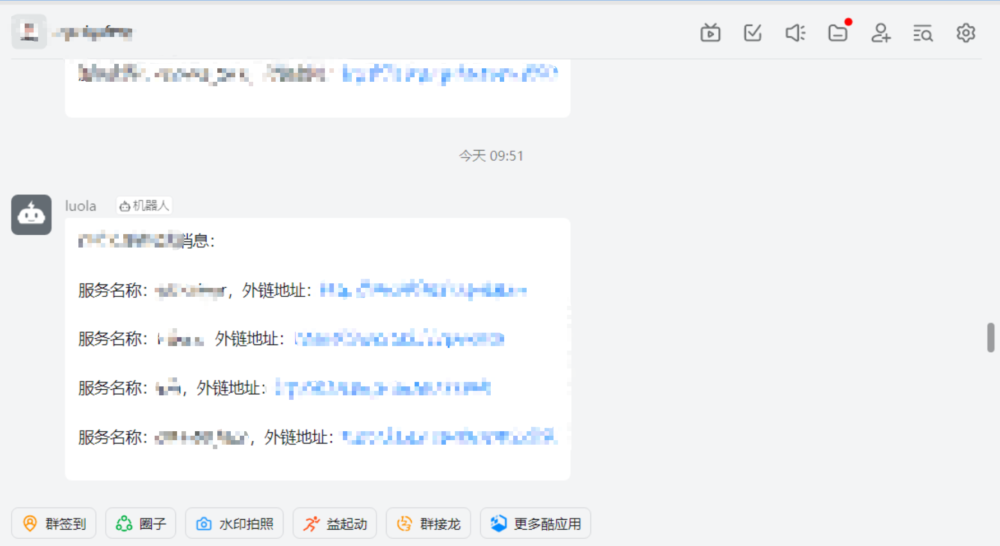
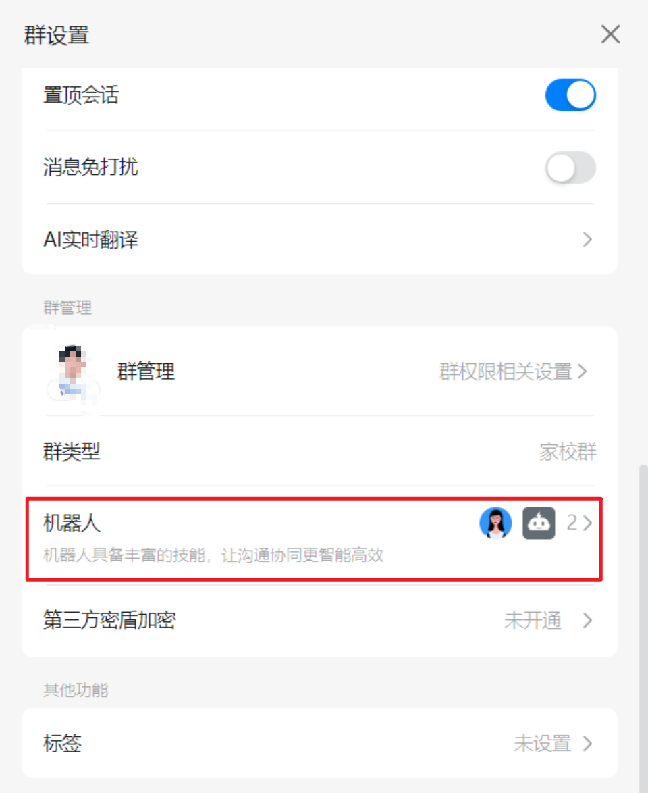
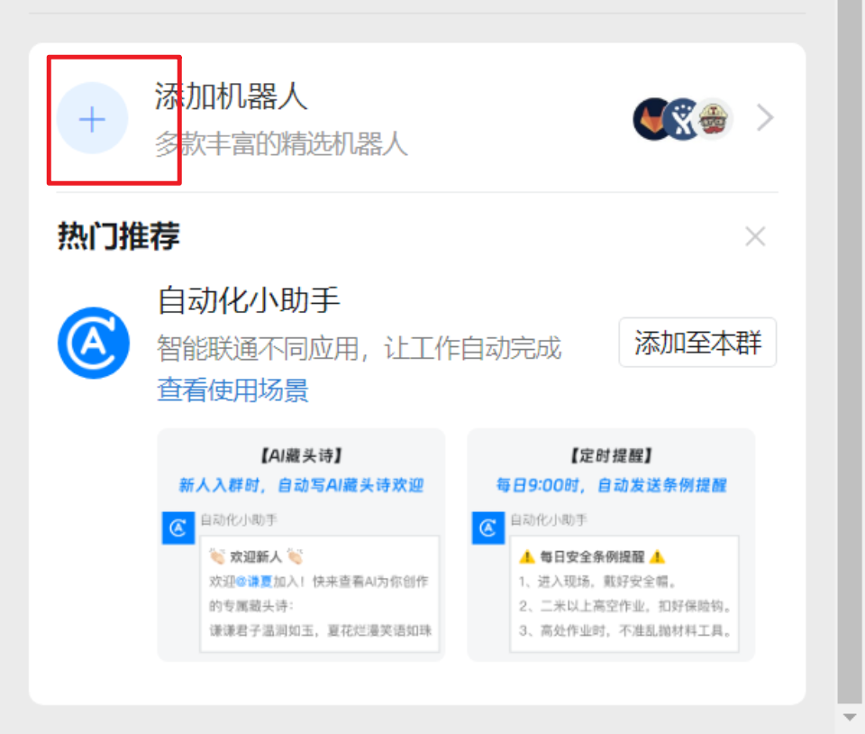
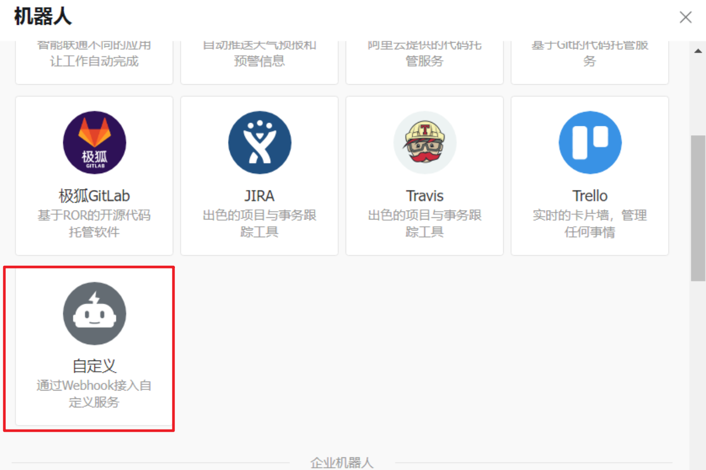
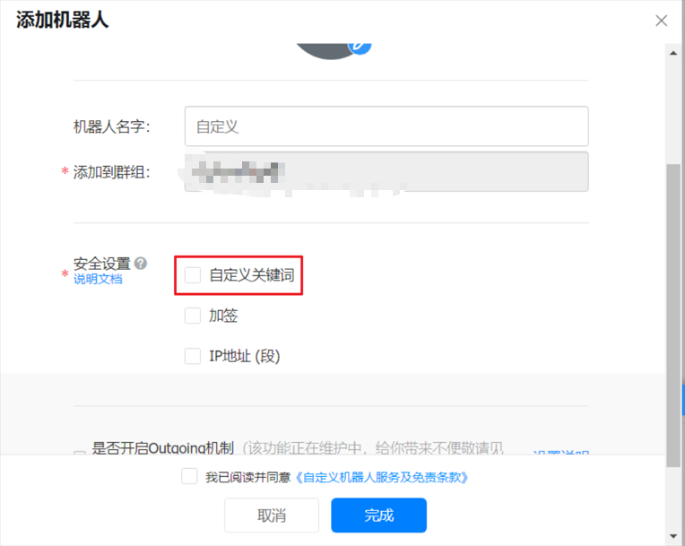

# 1 项目介绍
## 1.1 简介
用于定时自动获取免费、付费版本的CPOLAR隧道地址。在此之前你应该在你的个人PC上安装好CPOLAR服务，并启动。
钉钉机器人服务效果图



## 1.2 版本
| 条目    | 版本 | 描述       |
|-------|----|----------|
| Jdk   | 11 |          |
| Redis | 7.4.0 | 缓存历史链接信息 |

# 2 配置修改
## 2.1 修改内容
- 1 需要修改 application.yml 中 cpolar 用户名密码
- 2 需要修改 application.yml 中 钉钉机器人token
## 2.2 如何获取钉钉机器人token
### 2.2.1 创建钉钉群聊

### 2.2.2 添加机器人



### 2.2.3 设置机器人

关键字意思是在发送消息时必须包含该关键词，否则不发送消息
# 3 部署
## 2.1 docker方式部署
- 1 修改配置文件中的用户名密码token等，然后打包

- 2 将jar包和dockerfile丢入一个文件夹

- 3 执行构建命令
```shell
docker build --build-arg JAR_FILE=freeCpolarFrend-1.0-SNAPSHOT.jar -t free-cpolar-frend:latest .
```

- 4 docker部署
```shell
docker run -d --restart=always  --name xm-cpolar free-cpolar-frend:latest
```
## 2.2 使用公共镜像部署
```shell
docker run -d --restart=always --network=my-common-net \
-e REDIS_HOST=xxxxxxxxxxxxxx \
-e REDIS_PASSWORD=xxxxxxxxxxxxxx \
-e REDIS_PORT=6379 \
-e CPOLAR_USERNAME=xxxxxxxxxxxxxx \
-e CPOLAR_PASSWORD=xxxxxxxxxxxxxx \
-e DINGTALK_OPEN=true \
-e DINGTALK_ROBOTTOKEN=xxxxxxxxxxxxxx \
-e DINGTALK_KEYWORD=xxxxxxxxxxxxxx \
--name xm-cpolar registry.cn-hangzhou.aliyuncs.com/mk-release/free-cpolar-friend:latest  
```
| 条目    | 描述                | 是否必填 |
|-------|-------------------|------|
| --network   | 指定docker网络     | 非必填  |
|-e REDIS_HOST| redis地址         | 必填   |
|-e REDIS_PASSWORD| redis密码      | 必填     |
|-e REDIS_PORT| redis端口默认6379     | 非必填  |
|-e CPOLAR_USERNAME| cpolar用户名     |必填 |
|-e CPOLAR_PASSWORD| cpolar密码   |必填    |
|-e DINGTALK_OPEN| 是否开启钉钉提醒默认true|非必填 |
|-e DINGTALK_ROBOTTOKEN| cpolar用户名  |必填 |
|-e DINGTALK_KEYWORD| cpolar用户名    |必填 |

## 2.3 jar 方式部署
- 1  安装jdk11
- 2  java -jar xxxx.jar